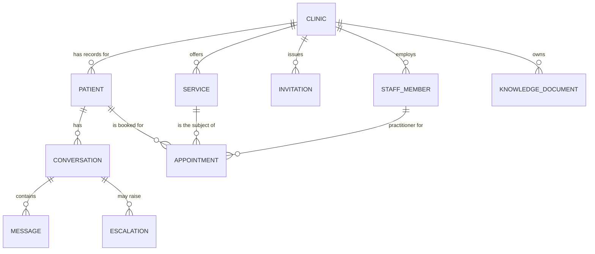

# Entity-Relationship Diagram

Conceptual only. No attributes, columns, or types appear on the entities below — this is a map of
what relates to what, not a schema. See [`01-entities.md`](./01-entities.md) for what each entity
means and [`04-relationships.md`](./04-relationships.md) for cardinality reasoning.

## Reading guide

- Each box is an Entity or Aggregate Root — this diagram deliberately shows no attributes inside
  them, since a list of fields would start to read as column design, which is out of scope for a
  conceptual model.
- Each line is a relationship; the label names it in plain language (matches
  [`04-relationships.md`](./04-relationships.md)).
- The crow's-foot notation on each end reads as "exactly one" (`||`) or "zero or more" (`o{`).
  Every relationship in this model is one-to-many in that shape: one Clinic to many Services, one
  Conversation to many Messages, and so on — there is no many-to-many relationship anywhere in
  this diagram.
- CLINIC is the tenant boundary and has no incoming arrows from any other entity — everything
  else in the diagram traces back to exactly one CLINIC, directly or transitively (CONVERSATION
  and APPOINTMENT reach it through PATIENT).
- MESSAGE and ESCALATION are drawn hanging off CONVERSATION because they are internal entities of
  the Conversation aggregate ([`02-aggregates.md`](./02-aggregates.md)) — they have no existence
  or identity independent of the conversation that contains them.
- SERVICE and STAFF_MEMBER both point into APPOINTMENT because an Appointment is meaningless
  without knowing what it's for and who delivers it — but neither SERVICE nor STAFF_MEMBER is
  _contained by_ Appointment; both are separate aggregates referenced by identity.
