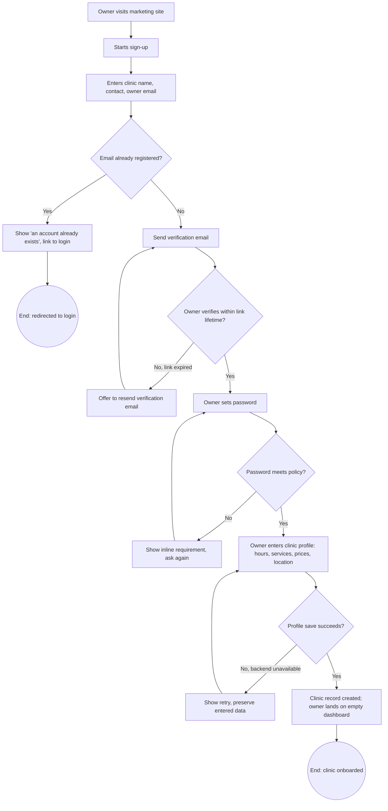
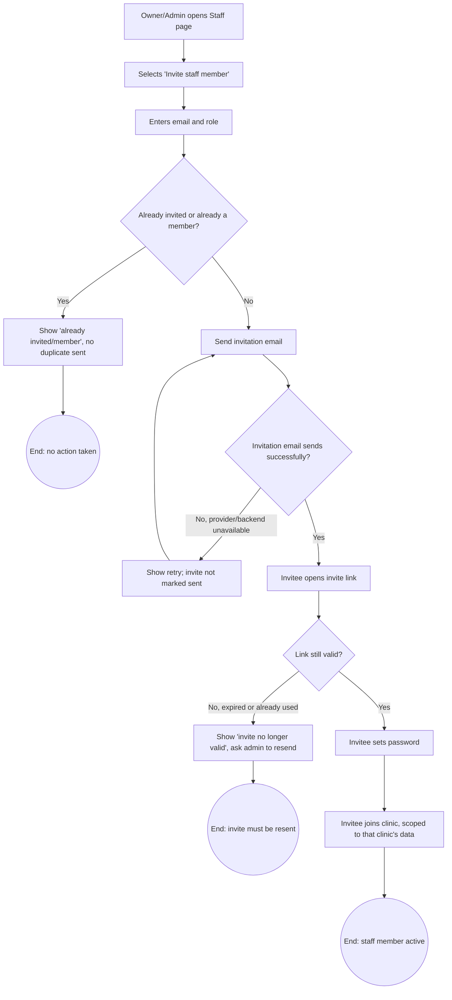
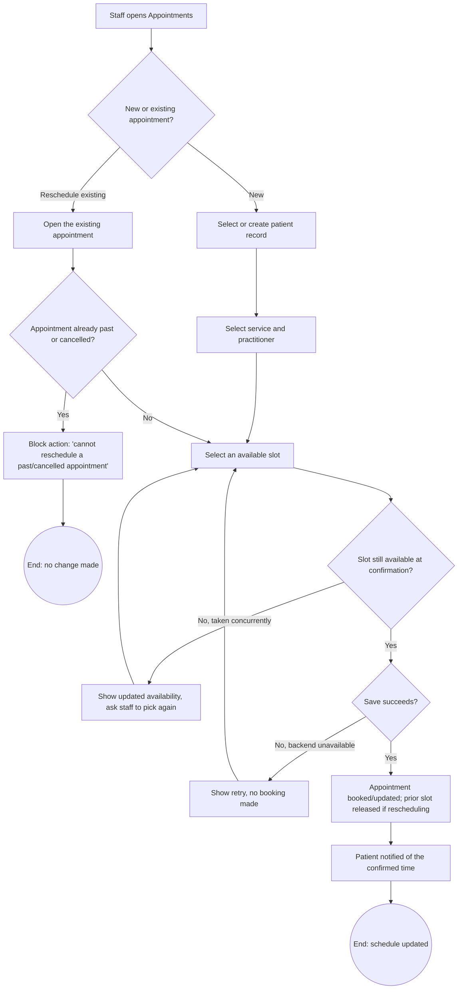
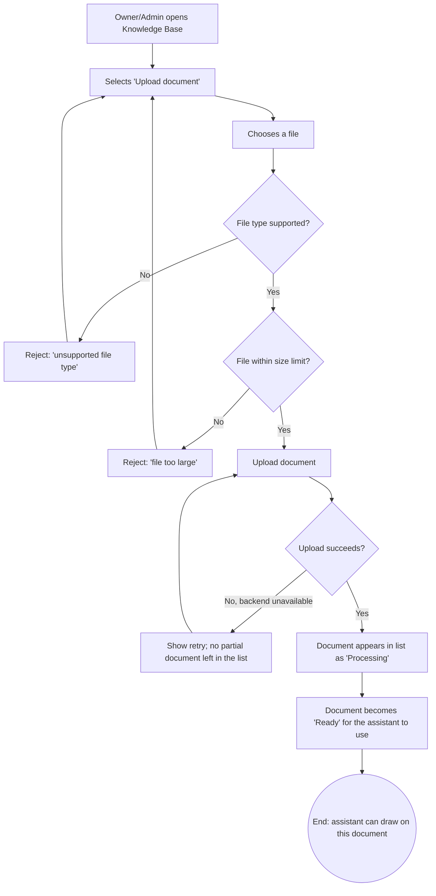
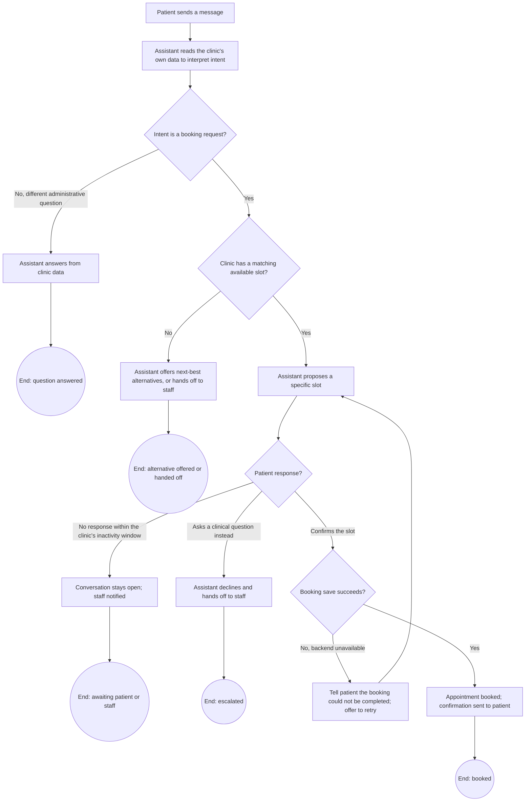
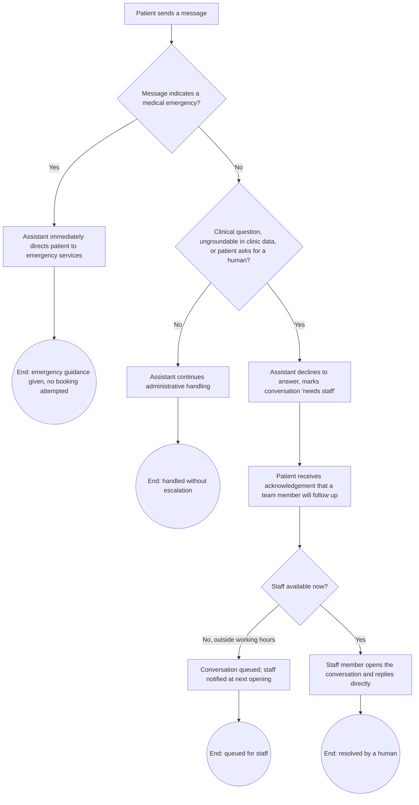

# User Flows

Each flow shows decision points and failure branches — a flow with only a happy path is
incomplete by definition for this document. These describe user-visible behavior only; no flow
here implies a particular database, API, or AI pipeline design (those are Deliverables B and C).

## Clinic sign-up and first-run setup

## Inviting a staff member

## Creating and rescheduling an appointment

## Uploading a knowledge document

## A patient conversation ending in a booking

## A patient conversation that must escalate to a human

